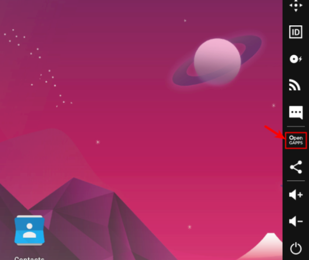

# cc11  
  
Links of interest:  
  
https://github.com/MobSF/Mobile-Security-Framework-MobSF  
https://mobsf.github.io/docs/#/  
https://www.genymotion.com/  
https://www.oracle.com/virtualization/technologies/vm/downloads/virtualbox-downloads.html  
https://github.com/m9rco/Genymotion_ARM_Translation  
https://frida.re/  
https://github.com/az0mb13/frida_setup  
https://arben.sh/bugbounty/Configuring-Frida-with-Burp-and-GenyMotion-to-bypass-SSL-Pinning/  
https://blog.dixitaditya.com/one-click-ssl-pinning-bypass-setup  
https://portswigger.net/burp  
https://github.com/skylot/jadx  
https://github.com/dwisiswant0/apkleaks  
https://github.com/arainho/awesome-api-security  
https://book.hacktricks.xyz/mobile-pentesting/android-app-pentesting  
https://apisecurity.io/issue-194-api-testing-checklist-api-security-testing-resources-cvss-for-api-security/  
https://hackanythingfor.blogspot.com/2020/07/api-testing-checklist.html  
https://labs.detectify.com/2021/08/10/how-to-hack-apis-in-2021/  
https://github.com/brendan-rius/c-jwt-cracker  
https://github.com/assetnote/kiterunner  
https://alfred.camera/  
https://issuetracker.google.com/issues/215633908  
https://github.com/firebase/firebase-admin-node/issues/1141  
https://bugzero.io/reports/238  
https://www.hedgeprotect.com/  
https://oauth.net/2/grant-types/password/  
https://www.dahuasecurity.com/asset/upload/uploads/soft/20191127/Catalog_Dahua-Technology_V2.0_EN_201911(38P).pdf  
https://www.dahuasecurity.com/newsEvents/pressRelease/351  
https://us.dahuasecurity.com/public-policy/faqs/fcc-rulemaking-process/  
https://openplatform-public-or.s3-us-west-2.amazonaws.com/openplatform-public-or/source_1636336389292/Imou%20Cloud%20Security%20White%20Paper_V1.0903.pdf  
https://open.imoulife.com/book/start.html  
https://owasp.org/www-project-mobile-top-10/  
https://owasp.org/www-project-api-security/  
https://fidoalliance.org/how-fido-works/  
https://foundation.mozilla.org/en/privacynotincluded/  
  
  
Lab info:  
  
Ubuntu 20.04  NOT 22  
MobSF: Mobile Security testing platform  
Genymotion: Virtual Devices  
VirtualBox: Improved VM experience  
JADX: Decompile APK, helps find creds  
APKLeaks: Scanning APK for URIs, endpoints & secrets  
Frida: Capture network traffic  
Burp Suite  
Postman  
  
Genymotion and Google services: Some Android apps require Google services. If the app is complaining about no Google services, use the Open GAPPS feature in Genymotion to fix that error.  
  
  
MobSF: install git, Python 3.8, JDK 8   https://mobsf.github.io/docs/#/requirements  
git clone https://github.com/MobSF/Mobile-Security-Framework-MobSF.git  
cd Mobile-Security-Framework-MobSF    and   ./setup.sh  
  
To run MobSF: ~/Mobile-Security-Framework-MobSF/./run.sh 127.0.0.1:8000  then visit 127.0.0.1:8000 in a browser.  
  
Frida: pip install Frida   and   pip install frida-tools  
  
Set up a better Frida script in MobSF:  
sudo git clone https://github.com/az0mb13/frida_setup  
Make a backup of the original MobSF frida script at  
~/Mobile-Security-Framework-MobSF/mobsf/DynamicAnalyzer/tools/frida_scripts/default/ssl_pinning_bypass.js  
Rename frida3.js to ssl_pinning_bypass.js and move to the above directory.  
  
Install JADX:  
sudo git clone https://github.com/skylot/jadx.git /usr/local/jadx   
then   ./gradlew dist  
  
To run JADX: /usr/local/jadx/build/jadx/bin/sudo ./jadx-gui  
  
Install apkleaks: pip3 install apkleaks  
  
To run apkleaks: sudo apkleaks -f [path to apk] -o [path to output file]  
  
Running Burp Suite in the Android Lab:  
Define a network bridge in Genymotion VM and make note of IP address and port.  

Run Frida manually:  
adb root  
adb connect 192.168.x.x:5555  
adb push frida-server /data/local/tmp/  
adb shell "chmod 755 /data/local/tmp/frida-server"  
adb shell "/data/local/tmp/frida-server &"  
frida -U -f [path to APK file] -l ~/frida_setup-master/frida3.js  
https://arben.sh/bugbounty/Configuring-Frida-with-Burp-and-GenyMotion-to-bypass-SSL-Pinning/  
  
